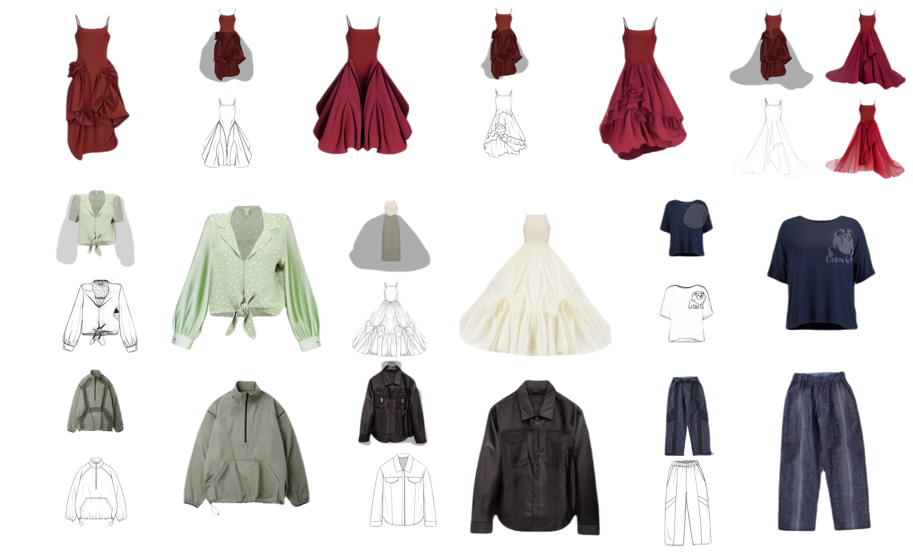

ban# ControlEdit: A MultiModal Local Clothing Image Editing Method

**Abstract:**
Multimodal clothing image editing refers to the precise adjustment and modification of clothing images using data such as textual 
descriptions and visual images as control conditions, which effectively improves the work efficiency of designers and reduces the threshold 
for user design. In this paper, we propose a new image editing method-ControlEdit, which transfers clothing image editing to multimodal-
guided local inpainting of clothing images. We address the difficulty of collecting real image datasets by leveraging the self-supervised learning 
approach. Based on this learning approach, we extend the channels of the feature extraction network to ensure consistent clothing image 
style before and after editing, and we design an inverse latent loss function to achieve soft control over the content of non-edited 
areas. In addition, we use Blended Latent Diffusion as the sampling method to make the editing boundaries transition naturally and enforce
 consistency of non-edited area content. Extensive experiments demonstrate that ControlEdit surpasses baseline algorithms in both 
qualitative and quantitative evaluations.
## Code Release Plan

Currently, the code is not available. The code and related resources will be released at a later date. Stay tuned for updates.

